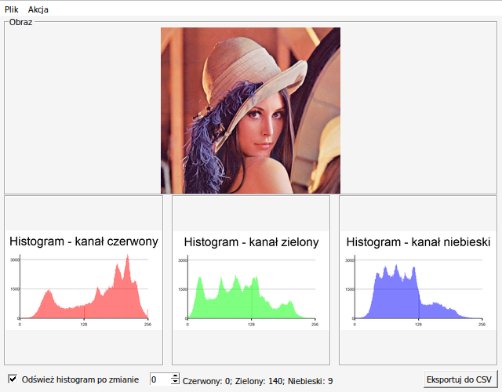
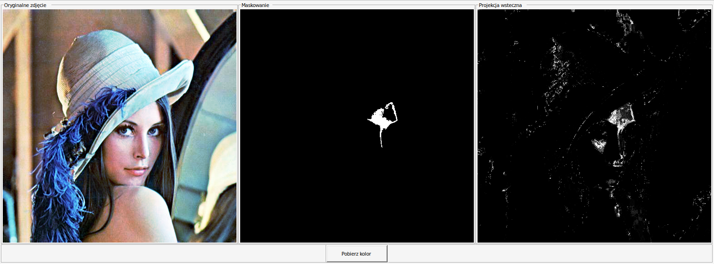

# ImageTrick

The project ImageTrick is a GUI image manipulator that was written in Python during my study. The main purpose of this program is to manipulate image by using available tools from OpenCV library. 

Used libraries:
* OpenCV (pip install opencv-python)
* Pillow (pip install Pillow)

As a GUI the program uses Tkinter

Screenshots of the project:

## How to run program

First, make sure that you have installed libraries that were mentioned before, then type in console or terminal: `python imagetrick.py` or `python3 imagetrick.py`

Program tested in system operation: Windows